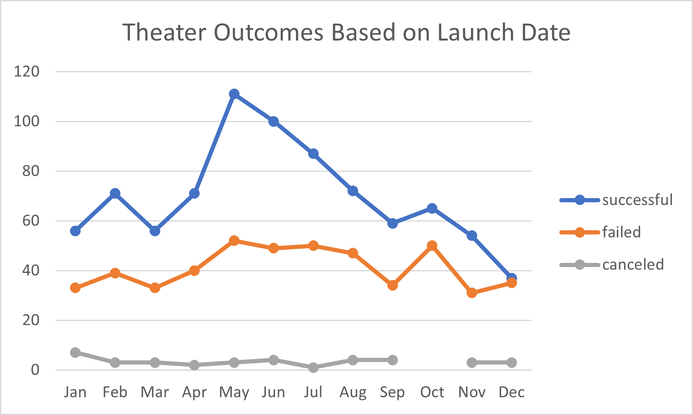
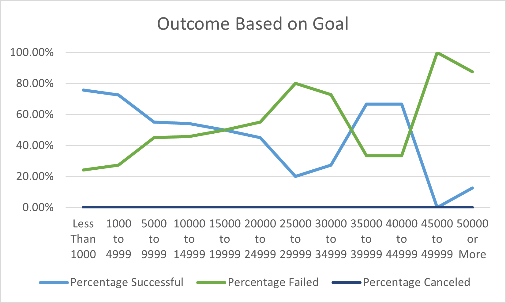

# Kickstarting with Excel

## Overview of Project

### Purpose
Our client Louise is requesting data on other kickstarters to compare the relationship between their launch dates and their funding goals. In order to fulfill her request, I created 2 charts based on launch dates and goals to draw conclusions and use them to our advantage. 

## Analysis and Challenges

### Analysis of Outcomes Based on Launch Date

Looking at the graph we can see the range of May through June has the best outcomes for kickstarters and the end of the year holds unfavorable outcomes. May is the most favorable month as it has the highest successful outcomes and it has the biggest gap between successes and failures for the months so we should lauch the kickstarter during this month.

### Analysis of Outcomes Based on Goals

The highest success rate lies within the ranges of lower than 5000 and 35000 through 44999. People's willingness to donate starts high during lower goals and falls when it grows. The success in the 35000 through 44999 range could be due to more kickstarters with well defined steps and visions for their projects. Depending on the size of the project, the 35000 or higher may be the goal that we should choose.

## Challenges and Difficulties Encountered

Possible challenges that may come from deriving graphs from the data may come from the large amoount of data types given in the original worksheet. Not knowing what data should be used in the graph can cause graphs to look busy or give information that is not important. 

## Limitations and Recommendations

The time data given does not specify when the donations were given during the kickstarter so what may be more important than start date is rather the concentration of when the bulk of the donations are given. We also weren't given the client's country where they are running their kickstarter. This could be another factor that we could have used to get more accurate conclusions. One graph that we could make is a bar graph of the kickstarters that failed by month to see how close some of them were. Depending on how close to their final goal they were, we can gather information to see which months have more currency incoming to the kickstart site.
